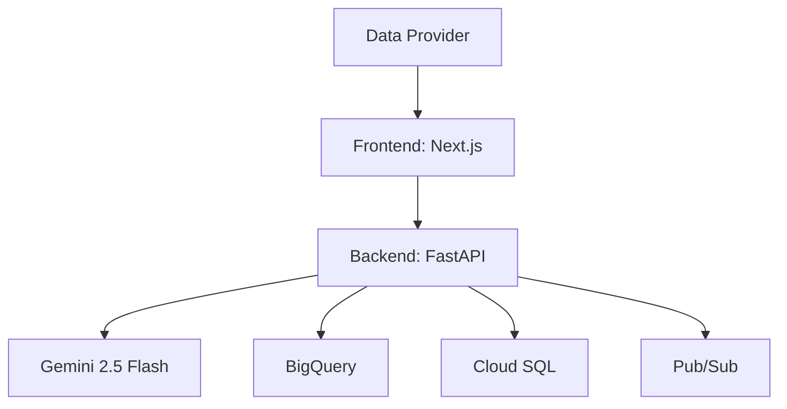

# Architecture

```mermaid
graph TD
    A[Frontend: Next.js] --> B[Backend: FastAPI]
    B --> C[Gemini 2.5 Flash]
    B --> D[BigQuery]
    B --> E[Cloud SQL]
    B --> F[Pub/Sub]
    G[Data Provider] --> A
```

FairGuard utilizes causal inference (DoWhy) and stability analysis (Rhea-style perturbations) to audit models.
